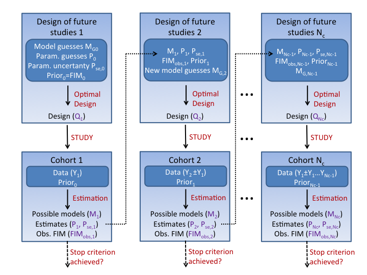
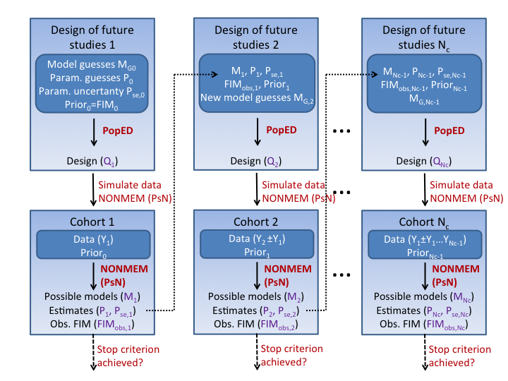

# Introduction
The MBAOD (Model Based Adaptive Optimal Design) package can be used to simulate clinical trials using predefined adaptive and optimization rules.  In addition the package can be used to optimize any specific cohort of an actual study using MBAOD.

Adaptive designs (AD), in general, are a way to adapt experiments as your understanding of the system you are studying improves through intermediate analyses of the experimental data.  Adaptive **optimal** design (AOD) uses optimal design theory as a way to design the next stage of your study.  In this package we are assuming the use of **population** models for both the estimation of parameters (analysis of data) as well as for the optimization of the various cohorts of our experiment (see figure \ref{general_schema}). 



This package currently uses PopED, NONMEM, PsN and R to handle the various tasks inherent to simulating and evaluating an MBAOD experiment (see figure \ref{specific_schema}).  The code has been written to be (hopefully) quite modular, so that other tools can easily be switched in place of the current tool set (e.g. PFIM instead of PopED). 



This document describes how to install and use the MBAOD (Model Based Adaptive Optimal Design) package.  


# Installation

1. You need to have R installed.  Download the latest version of R from http://www.r-project.org.

2. Install PopED for R (https://github.com/andrewhooker/PopED). To install the latest stable release from CRAN, write at the R command line: 
    
```{r, eval=FALSE}
    install.packages("PopED")
```
    
3. NONMEM and PsN (http://psn.sf.net) should be installed. 

4. Download the MBAOD package from https://github.com/andrewhooker/MBAOD.  On the right hand side of the page there are links to "Clone in Desktop" and "Download ZIP". Alternatively, if you want to use the latest version of MBAOD but aren't interested in developing the code, you can use the `devtools::install_github()` from the R command line. The `install_github()` 
approach requires that you build a package from source, i.e. `make` and compilers must be installed on your 
system -- see the R FAQ for your operating system ; you may also need to install dependencies manually:

```{r, eval=FALSE}
    devtools::install_github("MBAOD",username="andrewhooker")
```

# Overview of the MBAOD package

The MBAOD package's main tool is the `mbaod_simulate()` function, which simulates model based adaptive design scenarios. 
The function's main argument `cohorts` accepts a list of cohorts to run. Each cohort, in turn, is a list of, potentially, 4 named lists: "design", "optimize", "simulate" and "estimate". Each list can be `NULL` or a list of elements:
    
* "design" is a list that defines the (initial) design for that cohort. 
* "optimize" is a list that defines what to do for the optimization segment for that cohort.
* "simulate" is a list that defines what to do for the simulation segment for that cohort.
* "estimate" is a list that defines what to do for the estimation segment for that cohort.

There are a number of optional arguments (see `args(mbaod_simulate)`) including:

* `ncohorts` specifies the number of cohorts in the adaptive design procedure. If larger than the length of `cohorts` then 
the cohort information is inhereted from the last cohort in the list.
* `rep` specifies the number of times the adaptive design procedure should be repeated.

The MBAOD package also has a few plotting functions to visualize the output from `mbaod_simulate()`, including `mbaod_vpc()` and `plot_parameter_estimates()`.  

In order to show how the MBAOD package works we present below some working examples.

# An example: Adaptive design of a PK bridging study from adults to children

In this example we will simulate multiple realizations of a hypothetical clinical trial to bridge the pharmacokinetics (PK) of an adult population into a children.   

## The Model
### The adult model   
We assume that the drug PK in adults can be described by a one-compartment model  additive and proportional residual error. For each individual $i$ we have: 

$$
\begin{aligned}
y_i=\frac{DOSE_i}{V_i} \cdot e^{-({CL}_i/V_i) \cdot t_i} \cdot (1+\varepsilon_{prop,i}) + \varepsilon_{add,i}
\end{aligned}
$$

We assume a log-normal distribution of parameter values within individuals of the study population, thus, for $P \in (C{L},V)$ we have:

$$ P_i = P_{pop} \cdot e^{\eta_{P,i}}, \; \; \eta_{P,i} \in N(0,\omega^2_{P})$$

We also assume that the residual error terms come from normal distributions:

$$ \varepsilon_j \in N(0,\sigma^2_{j}) $$

### The maturation model   
There are several methods that can be used to describe the link between PK in adults and 
children. For this example we use a relatively simplistic approach assuming an emax maturation function for CL dependent on weight (WT) as well as a weight adjusted volume parameter:

$$ 
\begin{aligned}
{CL}_i & = {CL}_{BASE,i} + \frac{{CL}_{MAX} \cdot {WT}_i^\gamma }{{WT50}^\gamma + {WT}_i^\gamma } \\    
V_i & = V_{STD,i} \cdot  \frac{{WT}_i}{70}
\end{aligned}
$$

Where $V_{STD,i}$ and ${CL}_{BASE,i}$ are assumed log-normally distributed as above.

### Parameter values
We assume that the underlying true model of the system is the "Adult model" with $CL_i$ and $V_i$ defined by the "Maturation model". Parameters for all simulations are (the "true" parameter values):

```{r, results='asis',echo=FALSE}
true_values <- c(thetas=c(1,20,2,25,5),
                 omegas=sqrt(c(0.05,0.05)),
                 sigmas=sqrt(c(0.015,0.0015)))
params_formated <- format(data.frame(t(true_values)),digits=3)
colnames(params_formated) <- c("$CL_{BASE, pop}$","$V_{STD, pop}$","$CL_{MAX}$","$WT50$","$\\gamma$",
                               "$\\omega_{CL_{BASE}}$","$\\omega_{V_{STD}}$",
                               "$\\sigma_{prop}$","$\\sigma_{add}$")
knitr::kable(params_formated,caption="The true parameter values")
```

## Design 1   
In this design, we begin by simulating an initial cohort of adult patients using a fixed design.  Parameter estimates from that initial cohort are then used to optimize the next cohort containing children.  Optimization wiLL be on the weights  as well as the sample times of the future cohorts.  In this design we assume that each new cohort will contain groups of individuals with only one value of weight. An obvious simplification, but a starting point none-the-less.

The R commands found below are also available as an R script in the code repository in the directory 
"/inst/examples/Ex_1_bridging/poped_r/Example_1.R".  We begin our example by setting the path to this directory 

```{r}
setwd("~/Documents/_PROJECTS/AOD/repos/MBAOD/inst/examples/Ex_1_bridging/poped_r")
```

```{r setglobal, cache = FALSE, include = FALSE}
knitr::opts_knit$set(root.dir = "~/Documents/_PROJECTS/AOD/repos/MBAOD/inst/examples/Ex_1_bridging/poped_r")
```

Next we load the MBAOD package.  Change the path in the code below to where you have the code on your computer. If you used the `install_github()` method to install MBAOD then a simple `library(MBAOD)` will work instead.

```{r, results='hide', message=FALSE}
devtools::load_all("~/Documents/_PROJECTS/AOD/repos/MBAOD")
```

### Defining the first cohort
Now we can define the first cohort in the model based adaptive optimal design.  
```{r}
cohort_1=list(
  design = list(
    groupsize = 50,
    a = c(WT=70),
    xt = c(0.1,1,2,4,6,8,24)),
  optimize=NULL,
  simulate=list(target="NONMEM",
                model="./NONMEM_files/sim.mod",
                data=list(dosing = list(list(AMT=1000,Time=0)),
                          manipulation = list(expression(AMT <- AMT*WT/70)))
                ),
  estimate=list(target="NONMEM", 
                model="./NONMEM_files/est_red.mod"))
```

#### The `design` argument

The elements of the `design` list are passed as arguments to the function `create_design()` to create a design object. 
The code above creates a design with one group of 50 individuals, 
all of whom weigh 70 kg and have 7 identical sample times. 
The allowed arguments to can be seen with `args(create_design())` and are described  
in the documentation for `?PopED::create.poped.database` 
(look in the "Arguments" section, under "START OF INITIAL DESIGN OPTIONS").  

#### The `optimize` argument

The `optimize=NULL` argument indicates that we do not optimize this cohort's design in any way.

#### The `simulate` argument

The `target` argument determines which tool is used to simulate data.  Currently `"NONMEM"` and `"poped_R"` are allowed options. 

The `data` argument contains a list information about adding and manipulating 
columns in the simulation dataset.   The `dosing` argument in this list is a list of lists that adds dosing records to the 
simulation dataset (Each inner list corresponding to a group in the cohort design). The `manipulation` agument is 
used to transform the resulting columns of the dataset (or create new columns), and is a list of one or more `expression()` 
arguments. For example the above code adds dosing records `AMT=1000` at `Time=0` 
and trandforms the `AMT` column of the dataset to be 
dependent on `WT` (we know `WT` to be 70 in this first cohort but this will be optimized, and 
therefore unknown before the experiment, in future cohorts).

The `model` argument is the model that should be used for the simulation. 
If your target is NONMEM then there are a number of rules for 
creating the simulation model file.  First, by default  the name of the simulation data file created by the MBAOD 
package is called "sim_data.csv" 
(see argument `sim_data_input_fn` 
in `mbaod_simulate()`).  One should use this name in the `$DATA` 
section of the model file. Additionally the `$INPUT` section of the model file 
should expect the structure of the simulation input data file `sim_data_input_fn`. 
Currently the code use the create this dataset is:

```{r}
sim_data <- model_prediction(DV=T,
                             design=cohort_1$design,
                             dosing=cohort_1$simulate$data$dosing,
                             manipulation=cohort_1$simulate$data$manipulation)
head(sim_data)
```

Additionally, the NONMEM simulation model must have parameter estimates that are the "true" parameters for your system.
Finally, the NONMEM simulation model must produce a table file that can be used for estimation, 
and the name of that table file must be "mc_sim_1.tab" 
(i.e. the name defined in `sim_data_output_fn` from `mbaod_simulate()`).

If you were to use PopED in R for simulation instead of NONMEM then your simulation argument would look something like:

```{r cohort_1_poped_sim}
source("./PopED_files/poped.mod.PK.1.comp.maturation.R") # load the PopED model file

cohort_1_poped_sim  <- cohort_1
cohort_1_poped_sim$simulate <- 
  list(target="poped_R", 
       model = list(ff_file="PK.1.comp.maturation.ff",
                    fError_file="feps.add.prop",
                    fg_file="PK.1.comp.maturation.fg"),
       parameters = list(
         bpop=c(CL=1,V=20,EMAX=2,EC50=25,HILL=5),
         d=c(CL=0.05,V=0.05),
         sigma=c(PROP=0.015,ADD=0.0015)),
       data=list(dosing = list(list(AMT=1000,Time=0)),
                 manipulation = list(expression(AMT <- AMT*WT/70),
                                     expression(IPRED <- NULL),
                                     expression(PRED <- NULL),
                                     expression(Group <- NULL),
                                     expression(Model <- NULL))))
```


 Here we define the `model` as a PopED model with `parameters` as the "true" model parameters.  The allowed structure of the models and parameters section of this code is described in `?PopED::create.poped.database` 
(look in the "Arguments" section, under "START OF MODEL DEFINITION OPTIONS" and "START OF Model parameters SPECIFICATION OPTIONS").  Additionally we remove unneeded columns in the dataset directly with the `manipulation` argument, instead of doing this in the NONMEM code. Currently the code used to create the simulation  dataset using PopED in R is (directly creating `sim_data_output_fn`):

```{r}
cohort <- cohort_1_poped_sim
poped.db <- do.call(create.poped.database,
                              c(do.call(create_design,cohort$design),
                                cohort$simulate$model,
                                cohort$simulate$parameters))

sim_data <- model_prediction(poped.db=poped.db,
                             DV=T,
                             dosing=cohort$simulate$data$dosing,
                             manipulation=cohort$simulate$data$manipulation)

head(sim_data)
```


#### The `estimate` argument

In this first cohort we estimate on a reduced model without any maturation components as the data is not rich enough to estimate all parameters of the full model.

The `target` argument determines which tool is used to estimate data.  Currently `"NONMEM"` is the allowed option. 
The `model` argument is the model that should be used for the estimation. 
There are a number of rules for 
creating the estimation model file.  The estimation file name to use in the  `$DATA` section is called "est.dat".  The `$INPUT` section should match the structure seen in the  
the `sim_data_output_fn`.


### Defining the second cohort

The second cohort of patients is the first group of chldren.  We assume in this example that each cohort contains a homogenous group, all with the same (optimized) weight.  Our initial design is a weight half-way between 0 and 70 kg.  

```{r}
cohort_2 <- cohort_1
cohort_2$design <- list(
  groupsize = 20,
  a   = c(WT=35),
  xt = c(0.5,1,2,3,6,12,24)
  )
```

Next we define the how we would like to optimize this design.  In this case with PopED in R using the true model, a design space for the covariate (a) and the sample times (xt). Defining the `model` and `design_space` are as in `?PopED::create.poped.database` 
(look in the "Arguments" section, under "START OF MODEL DEFINITION OPTIONS" and "START OF DESIGN SPACE OPTIONS").  

The parameters for optimization are defined from the estimation in the previous step.  However, since only a reduced model was used for that estimation, additional initial parameter guesses are needed for the extra parameters in the full model used for optimization of this cohort. Currently the extra parameters are just added to the end of the current lists of estimated parameters.  A `manipulation` argument is provided for transformation of initial parameter values.  In this case, the previous cohort had just a $CL_{pop}$ term estimated, which is a combination of $CL_{BASE,pop}$ and $CL_{MAX}$.  Thus the parameter guess for the full model is $CL_{BASE,pop}=CL_{pop}-CL_{MAX}$.

Other settings of the optimization can be manipulated using `settings.db` which can include any argument available in `PopED::create.poped.database()` and `settings.opt` which can include any argument available in `PopED::poped_optimize()`, whcih is the optimization function used in the MBAOD package. In this example we declare that we want to optimize both sampling times and covariates ($WT$), that we want to use the random search algorithm, and that we should not compute inverses of our fisher information matrix (with only 2 cohorts the problem is underdetermined and thus the matrix is not invertable).  

```{r}
cohort_2$optimize <- list(
  target="poped_R",
  model = list(
    ff_file="PK.1.comp.maturation.ff",
    fError_file="feps.add.prop",
    fg_file="PK.1.comp.maturation.fg"
    ),
  design_space=list(maxa=70,
                    mina=1,
                    minxt=0,
                    maxxt=24),
  parameters=list(
    # initial parameter guess not coming from previous step
    bpop=c(EMAX=2,EC50=5,HILL=5),     
    # manipulation of initial parameters
    manipulation=list(expression(bpop[1] <- bpop[1]-bpop[3])) 
    ),
  settings.db=NULL,
  settings.opt=list(
    opt_xt=T,
    opt_a=T,
    bUseRandomSearch= 1,
    bUseStochasticGradient = 0,
    bUseBFGSMinimizer = 0,
    bUseLineSearch = 0,
    compute_inv=F
    )
  )
```

Lastly we define the estimation precedure for cohort 2, using the full model this time:

```{r}
 cohort_2$estimate <- list(target="NONMEM", model="./NONMEM_files/est_full.mod")
```

If we want to use PopED to simulate instead of NONMEM then we can use the previous simulation code in cohort 1:

```{r}
cohort_2_poped_sim <- cohort_2
cohort_2_poped_sim$simulate <- cohort_1_poped_sim$simulate
```


### Defining the third cohort

The third cohort is just like the second cohort except all of the parameters needed for optimization will now be estimated:

```{r}
cohort_3 <- cohort_2
cohort_3$optimize$parameters <- NULL

cohort_3_poped_sim <- cohort_2_poped_sim
cohort_3_poped_sim$optimize$parameters <- NULL
```

### MBAOD simulation

Next we simulate this MBAOD setup.  First just with one iteration to see that things are working.  Here we simulate 4 cohorts where the 4th cohort definition is identical to the 3rd cohort and thus does not need to be defined.

```{r,results='hide'}
results_all <- 
  mbaod_simulate(cohorts=list(cohort_1,cohort_2,cohort_3), 
                 ncohorts=4, # number of cohorts in one MBAOD 
                 rep=1, #number of times to repeat the MBAOD simulation 
                 name="Example_1", 
                 description="4 cohorts, 1 group per step")

```

```{r,echo=FALSE}
cat('--------- Final Design\n')
print_design(results_all$iteration_1$final_design)
tmp <- results_all$iteration_1
tmp$est_summary <- NULL
tmp$final_design <- NULL
cat('\n--------- Parameter estimation after each cohort\n')    
summarize_estimation(tmp)
```

The results demonstrate that the design gives relatively resonable estimates in the final cohort of patients.

simulate 100 times

compare with poped simulation

compare with 4 groups per cohort

cpmpare to optimal design with right parameter values

compare to optimal with wrong parameter values
